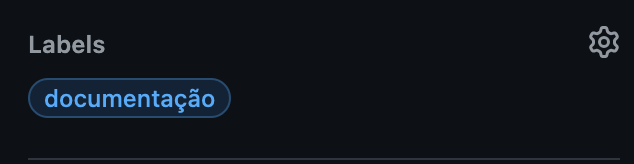

# Git e GitHub

- Todas as operações no **Git** e **GitHub** devem ser realizadas e documentadas em **português**, a fim de facilitar a comunicação e garantir a padronização do projeto em um único idioma.

---

## GitHub

### **Branches principais:**

- O repositório contará com duas **branches principais**: **main** e **develop**.

  - **Main:** Esta é a branch de produção, onde a versão estável e pronta para uso será mantida.
  - **Develop:** A branch destinada ao desenvolvimento contínuo, onde as novas funcionalidades e melhorias serão implementadas. Ela será criada a partir da **main** assim que o desenvolvimento começar.

- **Merges** nas branches **main** e **develop** devem ser realizados exclusivamente por meio de **pull requests**.

- Pull requests da **develop** para a **main** só serão aceitos após a realização de **testes rigorosos**, garantindo que o código esteja livre de erros e esteja em conformidade com os padrões de qualidade.

### **Branches para resolução de issues:**

- Cada **issue** será resolvida em uma **branch própria**, criada a partir da **develop** na versão mais recente. A **main** só será utilizada para criar novas branches no caso de a **develop** ainda não ter sido criada.

- As **branches de issue** devem seguir o seguinte padrão de nome: [padrão de commits](https://github.com/iuricode/padroes-de-commits)/<_código da issue_>.

  **Exemplo:** Imagine que você está trabalhando em uma issue relacionada à **documentação** com o código 30, a branch deverá ser nomeada como: [doc](https://github.com/iuricode/padroes-de-commits)/30.
  Isso facilita a identificação da branch e sua associação com a issue, e o que cada branch se propõe a resolver, antes mesmo de ler a issue.

- As **branches de issue** devem ser excluídas após o **merge** na **develop**.

- Em **nenhuma hipótese** uma **branch de issue** será diretamente mergeada na **main**. O fluxo correto é:

**Branch de Issue**
↓
**Pull Request / Aprovação / Merge**
↓
**Branch Develop**
↓
**Pull Request / Aprovação / Merge**
↓
**Branch Main**

Isso é fundamental, pois a **main** deve sempre refletir uma versão estável, sem erros que possam comprometer a aplicação.

- Caso uma issue possua problemas que são definidos por **padrões de commits** distintos, o desenvolvedor deverá criar uma branch de issue para cada padrão de commit.

  **Exemplo:** Imagine que você está implementando uma issue que trata de **melhoria de estilos** e implementação de uma **nova funcionalidade**, e possua o código 30. Então o desenvolvedor deverá criar uma branch chamada
  [style](https://github.com/iuricode/padroes-de-commits)/30 e outra chamada [feat](https://github.com/iuricode/padroes-de-commits)/30.

  Caso seja necessário uma alteração posterior da 'feat/30' ou da 'style/30', não será necessário a criação de uma nova branch com o nome 'fix/30', basta utilizar a branch que já existe. Isso apenas será necessário caso ambos (implementação da funcionalidade e melhoria de estilos) tenham tido algum problema.

### **Pull requests:**

- Ao criar um **pull request**, o desenvolvedor deve seguir o seguinte formato:

  - O **nome do pull request** deve ser o mesmo nome da branch que está sendo **comparada(compare**).

  

  - A **descrição do pull request** deve ser uma **lista não ordenada**, detalhando todas as alterações feitas na branch comparada e, ao final, incluindo o link para a issue resolvida.

  

  - O **pull request** deve ter pelo menos **um revisor**, que será responsável por avaliar o código e sugerir melhorias. Se houver apenas um revisor, ele deve ter mais conhecimento técnico que o desenvolvedor que fez as alterações.

  

  - O **pull request** deve ter ao menos **um responsável (assignee)**, que é o desenvolvedor responsável pelo código que está sendo revisado.

  

  - O **pull request** deve conter as **labels** apropriadas, caso existam, para indicar o tipo de mudança realizada na branch.

  

  - O **pull request** deve estar vinculado a um **milestone**, correspondente à sprint em andamento.

  

---

## Git

### **Commits:**

- Todos os **commits** devem seguir o padrão:
  [padrão de commits](https://github.com/iuricode/padroes-de-commits): <_mensagem do commit_>.
  **Exemplo:** Imagine que você implementou uma nova funcionalidade para filtragem de dados, a mensagem do commit será:
  [feat](https://github.com/iuricode/padroes-de-commits): implementei funcionalidade de filtragem de dados.
  Esse formato facilita a compreensão do que foi feito em cada commit, sem a necessidade de explorar detalhadamente as mudanças realizadas, seja no código adicionado, alterado ou removido.

  | Versão  |    Data    | Descrição                 | Autor                                              | Revisão                                      |
  | :-----: | :--------: | ------------------------- | -------------------------------------------------- | -------------------------------------------- |
  | `0.1.0` | 08/11/2024 | Estruturacão do documento | [Gabriel Barbaceli](https://github.com/Nibaacriba) | [João Pedro](https://github.com/johnaopedro) |
